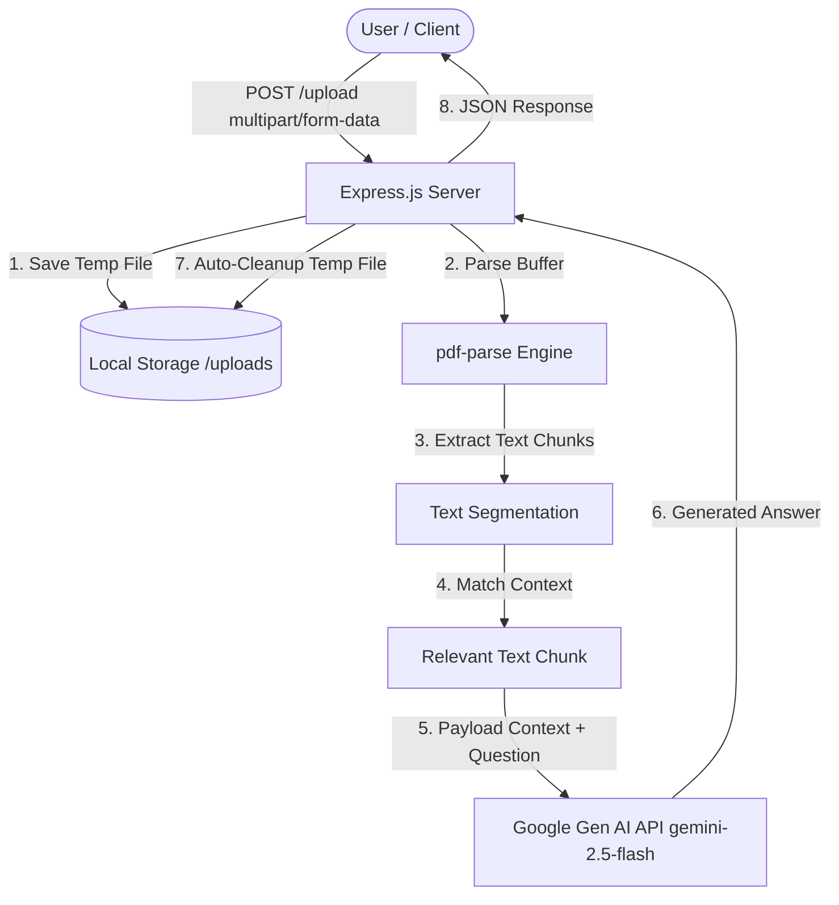

# AI-Powered PDF Query Engine (RAG-lite)

A containerized Node.js and Express application that allows users to upload PDF documents, extract textual content, and ask natural language questions against the document context using Google's **Gemini 2.5 Flash** model.

This project demonstrates production-ready fundamentals including:

* File stream handling
* Secure multi-part form parsing
* Automated temporary file cleanup
* Cloud AI SDK integration
* Docker-based deployment

---

# 🏗️ Architecture Diagram



---

# 🚀 Features

## PDF Text Extraction

Parses raw PDF streams efficiently into manipulatable text memory.

## Contextual Question Answering

Integrates Google's `@google/genai` SDK using `gemini-2.5-flash` for rapid and accurate contextual responses.

## Secure File Lifecycle

Utilizes `multer` for multipart file uploads and guarantees disk cleanup using `fs.unlink()` inside a `finally` block to prevent storage leaks.

## Production Isolation

Fully Dockerized to abstract environment configurations and maintain deterministic deployments.

---

# 🛠️ Tech Stack

| Layer            | Technology                                |
| ---------------- | ----------------------------------------- |
| Backend          | Node.js, Express.js                       |
| File Handling    | Multer, fs                                |
| PDF Parsing      | pdf-parse                                 |
| AI Engine        | Google Gemini AI SDK (`gemini-2.5-flash`) |
| Containerization | Docker                                    |

---

# ⚙️ Getting Started

## Prerequisites

Before running the application, ensure you have:

* Node.js v18+ installed
* Docker Desktop installed (recommended)
* Gemini API Key from Google AI Studio

---

# 🔐 Environment Variables

Create a `.env` file in the project root:

```env
PORT=3000
GEMINI_API_KEY=your_actual_gemini_api_key_here
```

---

# 🐳 Docker Deployment (Recommended)

Run the application in an isolated container environment.

## Build Docker Image

```bash
docker build -t pdf-query-engine .
```

## Run Docker Container

```bash
docker run -p 3000:3000 --env-file .env pdf-query-engine
```

Application will be available at:

```text
http://localhost:3000
```

---

# 🔧 Local Development

## Install Dependencies

```bash
npm install
```

## Start Application

```bash
npm start
```

Application will be available at:

```text
http://localhost:3000
```

---

# 🛑 API Reference

## 1. Health Check

### Endpoint

```http
GET /
```

### Response

```text
Server is Running fine
```

---

## 2. Upload PDF & Query Context

### Endpoint

```http
POST /upload
```

### Content Type

```http
multipart/form-data
```

### Parameters

| Parameter | Type     | Required | Description                   |
| --------- | -------- | -------- | ----------------------------- |
| file      | PDF File | Yes      | PDF document to process       |
| question  | String   | Yes      | Question to ask about the PDF |

---

### Example cURL Request

```bash
curl -X POST http://localhost:3000/upload \
  -F "file=@/path/to/document.pdf" \
  -F "question=What are the key terms for clients?"
```

---

### Example Response

```json
{
  "matchedChunks": "Example sentence containing client details extracted from the PDF...",
  "response": "Based on the provided document context, the key terms for clients involve..."
}
```

---

# 📂 Project Structure

```text
pdf-query-engine/
│
├── uploads/
│
├── src/
│   ├── routes/
│   ├── services/
│   ├── utils/
│   └── app.js
│
├── .env
├── Dockerfile
├── package.json
├── package-lock.json
└── README.md
```

---

# 🔄 Request Flow

1. User uploads PDF and question.
2. Multer stores PDF temporarily.
3. PDF content is extracted using `pdf-parse`.
4. Text is segmented into chunks.
5. Relevant chunk is selected.
6. Context and question are sent to Gemini.
7. Gemini generates contextual response.
8. Temporary file is deleted.
9. JSON response is returned.

---

# 🧹 File Cleanup Strategy

To avoid disk space accumulation:

```javascript
try {
    // Process file
} finally {
    fs.unlink(file.path, (err) => {
        if (err) {
            console.error("Cleanup failed:", err);
        }
    });
}
```

This ensures uploaded files are removed even if processing fails.

---

# 🔒 Production Considerations

### Input Validation

* File type validation
* File size limits
* Missing parameter handling

### Error Handling

* Graceful API responses
* AI service failures
* Corrupted PDF handling

### Security

* Environment variable secrets
* Temporary file cleanup
* Restricted upload directories

### Scalability

* Stateless containers
* Horizontal scaling support
* External object storage compatibility

---

# 🗺️ Future Roadmap

## Semantic Vector Search

Replace simple keyword matching (`.includes()`) with embedding-based semantic similarity using:

```text
gemini-embedding-001
```

---

## Vector Database Integration

Persist document embeddings using:

* Pinecone
* Milvus
* ChromaDB
* Weaviate

This enables:

* Multi-document search
* Faster retrieval
* Persistent knowledge storage

---

## Advanced Chunking Strategy

Implement:

* Recursive Character Chunking
* Semantic Chunking
* Sliding Window Overlaps

Benefits:

* Improved context retrieval
* Better answer accuracy
* Reduced hallucinations

---

## Multi-Document RAG

Support querying across multiple uploaded PDFs simultaneously.

---

## User Authentication

Add:

* JWT Authentication
* Role-Based Access Control (RBAC)
* API Rate Limiting

---

## Observability

Integrate:

* OpenTelemetry
* Prometheus
* Grafana

for monitoring and tracing.

# 👨‍💻 Author

Built using:

* Node.js
* Express.js
* Docker
* Google Gemini AI

as a lightweight Retrieval-Augmented Generation (RAG-lite) implementation demonstrating modern backend engineering practices.
